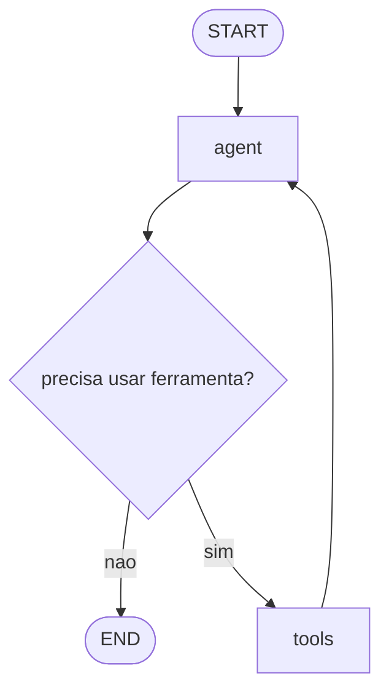

# AcademicFlow-Agent

Sistema colaborativo com agente ReAct usando LangGraph e Streamlit para apoiar
o planejamento de eventos academicos.

## Cenario Colaborativo

O AcademicFlow-Agent simula um grupo de estudantes ou organizadores planejando
um evento academico. Os participantes podem conversar com o agente para
registrar tarefas, guardar decisoes, criar secoes de um documento colaborativo
e consultar o estado atual do planejamento.

Usuarios simulados:

- Alice
- Bob
- Charlie

Papel do agente:

- apoiar a conversa do grupo;
- transformar combinados em tarefas e decisoes;
- organizar informacoes do projeto;
- consultar o quadro atual quando solicitado;
- sugerir proximos passos para a coordenacao do trabalho.

## Funcionamento Geral

O sistema usa um fluxo ReAct. A cada mensagem, o agente decide se deve responder
diretamente ou chamar uma ferramenta. Quando uma ferramenta e chamada, ela
atualiza a memoria simples do projeto e o resultado volta para o agente, que
gera uma resposta final para o usuario.

O estado do projeto e mantido em uma estrutura Python com:

- tarefas;
- decisoes;
- secoes de documento colaborativo.

## Grafo LangGraph



Nos do sistema:

- `agent`: chama o modelo LLM com o prompt do sistema e o historico da conversa.
- `tools`: executa ferramentas disponiveis para registrar tarefas, decisoes,
  secoes de documento ou consultar o quadro do projeto.

O ciclo `tools -> agent` permite que o agente use o resultado da ferramenta para
responder em linguagem natural.

## Ferramentas

As ferramentas implementadas em `React_Project.py` sao:

- `register_task`: registra uma tarefa com responsavel, prazo e status.
- `register_decision`: registra uma decisao importante do grupo.
- `update_document_section`: cria ou atualiza uma secao do documento colaborativo.
- `consult_project_board`: retorna um resumo do estado atual do projeto.

## Modelo 3C

### Comunicacao

A comunicacao acontece pelo chat da interface Streamlit. Cada mensagem enviada
ao agente fica associada ao usuario selecionado na sidebar.

### Colaboracao

A colaboracao aparece na construcao conjunta do planejamento. Os participantes
podem pedir ao agente para criar tarefas, registrar decisoes e atualizar secoes
do documento do evento.

### Coordenacao

A coordenacao acontece por meio do quadro do projeto. O agente organiza tarefas,
responsaveis, prazos, decisoes e secoes do documento, permitindo que o grupo
acompanhe o andamento do planejamento.

## Estrutura do Projeto

```text
AcademicFlow-Agent/
|-- React_Project.py
|-- ui.py
|-- README.md
|-- TEST_ROTEIROS.md
|-- requirements.txt
|-- requirements-dev.txt
|-- tests/
|   |-- conftest.py
|   |-- test_agent_configuration.py
|   |-- test_collaboration_tools.py
|-- logo.png
```

## Tecnologias

- Python
- Streamlit
- LangGraph
- LangChain
- Ollama
- Llama 3.2
- Pytest

## Como Executar

### 1. Criar ambiente virtual

```powershell
python -m venv venv
```

Se o PowerShell bloquear a ativacao do ambiente, use os comandos com
`.\venv\Scripts\python.exe` diretamente.

### 2. Instalar dependencias

```powershell
.\venv\Scripts\python.exe -m pip install -r requirements.txt
```

### 3. Baixar o modelo no Ollama

```powershell
ollama pull llama3.2
```

### 4. Iniciar o Ollama

Em outro terminal:

```powershell
ollama serve
```

### 5. Executar a interface

```powershell
.\venv\Scripts\python.exe -m streamlit run ui.py
```

A aplicacao abrira em:

```text
http://localhost:8501
```

## Como Usar

1. Selecione um usuario na sidebar.
2. Envie uma mensagem no chat.
3. Peca ao agente para registrar tarefas, decisoes ou secoes do documento.
4. Consulte o quadro do projeto pela conversa ou pela sidebar.

Exemplos:

```text
Crie uma tarefa para reservar o auditorio. Responsavel Alice. Prazo sexta-feira.
```

```text
Registre a decisao: o evento sera no auditorio principal. Motivo: comporta mais participantes.
```

```text
Qual o estado atual do projeto?
```

## Testes

O projeto possui testes unitarios para as ferramentas e configuracoes principais
do agente. Eles nao chamam o Ollama e nao executam a interface Streamlit.

Instale as dependencias de desenvolvimento:

```powershell
.\venv\Scripts\python.exe -m pip install -r requirements-dev.txt
```

Execute:

```powershell
.\venv\Scripts\python.exe -m pytest
```

Tambem ha roteiros de teste manual em `TEST_ROTEIROS.md`.

## Solucao de Problemas

### Erro de conexao com Ollama

Verifique se o Ollama esta rodando:

```powershell
ollama serve
```

Se o modelo nao existir:

```powershell
ollama pull llama3.2
```

### Bloqueio do Activate.ps1 no PowerShell

Use o Python do ambiente virtual diretamente:

```powershell
.\venv\Scripts\python.exe -m pytest
.\venv\Scripts\python.exe -m streamlit run ui.py
```
